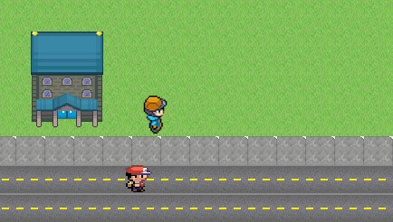

# Polimon

## Introdução

- Esse jogo está sendo desenvolvido para um projeto da disciplina de _Laboratório de Programação Orientada a Objetos (MAC0321)_, do _IME-USP_
- Ele tem o objetivo de fornecer um caso de uso prático para os conceitos de orientação a objetos vistos em aula.
- O jogo é uma versão do famoso _Pokémon_. A ideia é que o jogador possa:
  - se movimentar no mapa
  - Integrarir com NPCs para obter itens ou se curar 
  - Capturar Pokemóns

## Instruções para jogabilidade
- Para se movimentar no mapa, as teclas usadas são **W, A, S, D**
- Para andar de bicicleta, **basta segurar a tecla B**
- Para nadar na raia olímpica, basta apenas se aproximar da área. O jogador nada pelas águas em cima de um Pokémon aquático.
- Pokemons nascem, em um intervalo de tempo determinado, nas áreas correspondentes ao seu tipo.

OBS: não foi possível encontrar os mesmos _sprites_ para o _player_ nadando, andando e jogando de bicileta

## Looks and feels
- Para mudar a aparência do jogo, basta escolher o tema desejado no Menu Inicial.
- As opções são _Clássico_ e _Vintage_, sendo que o segundo deixa o jogo com uma aparência mais antiga e o primeiro com cores mais vivas
- As aparências mudam os elementos do mapa e o player.

## Pokémons
- Os _pokemons_ podem aparecem em áreas pré-determinadas (lógica feita pela classe `src/game/map/PokemonArea`)
  - Cada área tem uma lista com os tipos de _pokemons_ que podem aparecer nela, além de uma quantidade máxima de _pokemons_ que podem estar nela ao mesmo tempo.
  - Os tipos de _pokemon_ contam cada um com uma raridade, definida como uma probilidade de aparição, como é possível ver na classe `src/game/entity/PokemonType`.
  - Dentro de uma área, o tipo de pokemon que irá aparecer é escolhido aleatóriamente
- A quantida de _pokemons_ captura é mostrada também no canto superior direito da tela
- Para ver quais _pokemons_ foram capturados, basta aperta a tecla **P** e a pokedex irá abrir  

### Atualmente, as áreas para aparição de pokemons são
- Tipos Normal, Grama e Fada

  

- Tipo água

   

- Tipo Aço, Veneno, Pedra
  
  

- A cada 20 segundos, os Pokémons de cada região são regenerados seguindo uma lógica randômica:
  - Cada tipo possui uma porbabilidade de ser criado no mapa seguindo sua raridade.
  - Dado que deve ser criado, o Pokémon correspondente a um certo tipo é sorteado aleatoriamente do conjunto de Pokémons desse tipo.
- Para capturar um pokemon, basta chegar perto dele e apertar a tecla *ENTER*, o que te transportará para a tela de "combate"
  - Nesta tela, você poderá entre capturar o _pokemon_ ou correr; para capturar o pokemon, é necessário ter vida (HP) e _pokebolas_
  - As _pokebolas_ são mostradas no canto superior direito da tela e a vida (HP) é mostrada apenas na tela de "combate".
- Ao capturar Pokemons, a vida do player diminui e a sua experiência aumenta (ambos esses dados podem ser vistos a partir das barras de status na dela de combate)

## Interação com NPC
- Para integir com o NPC, basta ficar próximo dele e apertar a tecla **ENTER**; para passar os diálogos, basta pressionar a tecla **ESPAÇO**
  - Ao conversar com os dois NPCs a seguir, você ganhará _pokebolas_, que serão mostradas no canto superior direito da tela

    

    

  - Ao conversar com o NPCs a seguir, a sua vida (HP) será restaurada

    

## Estratégias dos NPCs e Pokémons
- As estratégias presentes para os NPCs e Pokémons são:
  - Andar aleatoriamente
  - Ficar parado
- Essas estratégias podem ser definidas do menu inicial do jogo (para voltar ao menu, basta pressionar **ESC**)
- Para permitir que diferentes NPCs tenham suas estratégias definidas a partir de uma mesma instância, foi usado o método Prototype.
- Devido às particularidades da implementação dos Pokémons, não foi usado o método Prototype nessa situação, dando preferência para uma simples alteração da estratégia de cada Pokémon.

## Música e efeitos sonoros
  - Algumas telas possuem efeitos sonoros tocados em loop quando essas telas são abertas
  - Dependendo da animação do player, ele emite sons diferentes

## Dificuldade
- As dificuldades foram implementadas a partir da interface `src/combate/GameMode.java`
- Dependendo da dificuldade, será mais fácil ou mais difícil capturar pokemons:
  - Fácil: sempre que tiver _pokebolas_ e vida, captura o Pokemon (ganha 10 de XP, perde 10 de vida)
  - Médio: se tiver _pokebolas_ e vida, chance de 70% para capturar o Pokemon (ganha 5 de XP, perde 15 de vida)
  - Difícil: se tiver _pokebolas_ e vida, chance de 50% para capturar o Pokemon (ganha 2 de XP, perde 20 de vida)
- Para gerenciar as dificuldades, foi usado o padrão _state_
- As dificuldades são alternadas a partir do **Menu**.

## Algumas informações sobre a implementação

- Para a confecção do mapa, foi usado o software [Tiled](https://www.mapeditor.org/) e _tilesets_ livres na internet
  - O software exporta um arquivo `.csv` com cada elemento correspondedo ao ID do tile dentro do spritesheet que está na posição correspondente do mapa. Dessa forma, lemos os spritesheets para cada camada com tilesets diferentes e renderizamos o mapa da tela a partir desse `.csv`.

- O jogo foi divido em estados (_Padrão State_), sendo possível transitar entre 4 destes estados na presente implementação
  - `RestScreen`: quando o usuário acabou de entrar no jogo.
  - `Menu`: para acessá-lo novamente basta pressionar **ESC**; no menu é possível escolher a fábrica e a estratégia de NPC e Pokémon desejada
  - `Play`: estado em que o jogador vai entrar efetivamente no mapa, podendo explorá-lo e interagir com os elementos dentro dele. Esse estado é subdivido
em mais estados internos, que indicam os ambientes ou estágios do jogo nos quais o jogador se encontra
    - `Outside`: mapa externo da USP, com NPCs e _pokemons_
    - `Biênio`: este é um estado interior; para acessá-lo, basta entrar no prédio redondo com teto rosado (como mostra a imagem abaixo)
      - 

- Buscamos sempre usar a injeção de dependências para evitar acoplamento excessivo entre classes.

- O padrão Strategy foi usado em mais 1 contexto:
  - Alterar entre as animações do Player

- O padrão State foi utilizado em mais 1 contexto:
  - Alternar a tela mostrada no jogo.